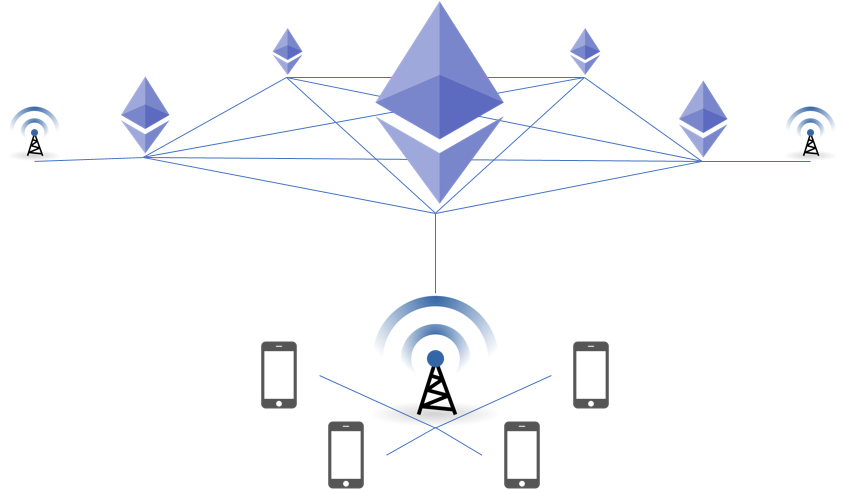

## Background

In 2013 Mark Zuckerberg published a 10 page whitepaper[1] elaborating a fact that majority of the world population does not have access to the Internet. This paper highlighted the importance of connectivity and how critical it was for developing regions to be part of this free flow of information.

In 2013 Facebook partnered with 6 other companies, to launch Internet.org[2] and provide selected services to developing countries for free. While Internet.org took off in a few countries, it received massive criticism after being introduced in India in 2015. Internet.org was amongst the few zero-rating networks introduced. Concerns that zero-rating networks controlled by private organizations put free speech and right to information at risk stopped them from gaining wide spread acceptance[3].

Today the numbers on connectivity look slightly better than they were in 2013. A few hundred million users plus; almost 40% of the world population today has Internet access[4]. At least 4 billion users are yet to receive their right to connectivity.

## How Zero-rating networks work

Internet Service Providers (ISPs) face costs when connecting to computers present on other networks that require ISPs to connect to a public Internet backbone. The volume of data usually dictates the pricing[5]. The primary goal of a zero-rating network is to keep costs at a minimum, and offer the network as an incentive to their customers. While there is no hard and fast rule, implementing a zero-rating Network could be done in the following few ways.

### Edge Caching

It is in interest of zero Rating networks to maintain a local copy of the data to be delivered to their users and avoid round trips outside the network. Caching of data isn't that uncommon amongst ISPs[6]. But caching the whole Internet brings massive storage economics into picture. This has led ISPs to provide selected services either hosted or cached on their own network in order to keep storage costs controlled.

### Proxy

ISPs can also choose to partner with web services that can invest in maintaining a zero-rating network. Internet.org does not cache web pages. It provides a free proxy to these selected services by partnering with developers and Telecom operators[7]. It is interest of Internet companies like Facebook to act as an entry-point for this new wave of Internet users.

## The concern with Zero-rating networks

Zero-rating network implementations so far have involved a central authority in shape of a private partnership that maintains control over the network. Even with complete transparency, there are very few legal safe guards stopping such an authority from blocking free speech or creating preferences over a network that they legally own. Such a privately administered network serving 2/3rds of the world population puts free flow of information at risk.

## An Ideal Zero-rating network

Following would act as key factors in creating a sustainable zero-rating network.

- Network operators should have clear oversight on storage and bandwidth costs.
- Content creators and service providers should have uniform costs to publish and maintain their services on the network.
- Content creators and Service providers should have open access to publishing tools.
- User should have up-to-date access to content, or be notified of out-of-date or delayed content state.
- The network should remain open for multiple network providers to participate.
- A Zero-rating network need not be a complete substitute to the Internet. The network should able to facilitate basic services like weather feeds, stock prices, news snippets, public sector announcements.
- Capability to carry out financial transactions, contributing to polls on the network can be considered a value addition.

## Blockchains for Zero-rating networks

Blockchains are distributed immutable ledgers maintained by allowing transactions on the ledger backed by cryptographic security. Integrity of the ledger is maintained by consensus in the network[8].

### Open Administration

Any individual, organization, foundation, government or network operator across the globe can practically participate in a public blockchain network, putting administration in the hands of the network consensus. Content creators and service providers can remain assured that their creation would reflect the same on every zero-rating service provided globally.

### Portable Identity

Identity on blockchains like that of Ethereum is created using asymmetric cryptographic algorithms like ECDSA. These algorithms can generate an account address and access key even in absence of a network[9].

Multiple network providers participating in a public blockchain will allow users to carry their identity across providers. This prevents provider lock-in for users of a zero-rating network.

### Content size

Every node in the blockchain maintains a copy of the ledger. The full ledger size of the Ethereum blockchain is ~100GB at time of writing. Factoring in growth after popularity of such a network, an Edge Cache could be a few Terabytes in size[10]. The deterministic size would allow network operators to maintain a budget for the network.

### Content creation

In case of Ethereum - creating or transacting with smart contracts that can store content, or act as a service requires "gas". Gas can be bought with Ether (Ethereum's native crypto currency). The cost involved in content/service creation ensures that the network is not spammed. This keeps the network size in control.

Network providers can allow users to add or update data on the network using Smart contracts. Gas prices can be paid by users using mobile wallets to sign to their transactions.

### Content consumtion

Making calls to smart contracts that do not add or update data on the network do not involve any costs in terms of gas. Smart contracts can be queried on the Edge Cache, with limited computation on behalf of the network provider[11].

### Readonly nodes

Based on their capability, network providers can choose to offer readonly services. In which case, network providers can choose to sync their ledgers periodically. Under such circumstances, network providers can indicate the latest block number on the public blockchain alongside the latest block number on their version of the ledger including the next scheduled update.

Readonly nodes can prove to be ideal for networks that provide free wifi hotspots and allow users to query the state of the blockchain. Farmers in remote areas for instance can use a daily updated readonly node to access weather feeds, crop information, market prices, etc.

### Services on the Blockchain

#### Secure Identity

Algorithms like ECDSA provide military grade security to accounts held by network users[12]. These identities can be integrated into systems outside the blockchain network. Governments, private organisations and Internet services can listen for transactions from these identities to carry out operations outside the blockchain.

#### Governance

Governments can associate identities on the blockchain with their Citizenship ID, allowing citizens to participate in government polls over a zero-rating network. Governments can ensure with such capability; every citizen has access to information and ability to convey their opinion.

#### Banking

Blockchain identities can be used to securely sign transactions to be picked up by banking services to send or receive funds.

#### Apps

While it is not economical to host smart phone applications on the blockchain, they can be delivered to user devices over the Internet. Once an application is installed on a user's device, the user can utilize the application to interact with smart contracts over a zero-rating network.

Applications like any blockchain based solution can allow users to import their identity, set RPC nodes to make calls or send transactions to.

## Roadblocks

While consuming data would remain free for users on a blockchain based zero-rating network, there are costs associated with creating content. User willing to add content over the network will have to bear the costs themselves, or delegate these costs to willing sponsors in shape of mining pools or service providers.

Reaching an agreement on the choice of a public blockchain would also require network providers to come together and understand the real requirements of their users. This also puts pressure on foundations and communities backing these public blockchains to deliver solutions that make it easier to onboard users who struggle to gain access to the open Internet.

## Conclusion

Edge Cached blockchain nodes can prove to be an economical, technically feasible and yet open entry point for users who have limited or no access to the Internet. Network providers can ensure that their costs are kept under control, and users are incentivized for choosing their network.

### References
1. [Is Connectivity a Human Right?](https://scontent-sit4-1.xx.fbcdn.net/v/t39.2365-6/12057105_1001874746531417_622371037_n.pdf?oh=62fe509ef2d093c8d64f77be706d8816&oe=599FCF27)
2. [Facebook And 6 Phone Companies Launch Internet.org To Bring Affordable Access To Everyone](https://techcrunch.com/2013/08/20/facebook-internet-org/)
3. [Critics on Facebook's Internet.org](http://mashable.com/2015/05/19/critics-facebook-internet/#ZiEAMzYx1iqi)
4. [Around 40% of the world population has an internet connection](http://www.internetlivestats.com/internet-users/)
5. [Data costs for ISPs](http://broadbandnow.com/report/much-data-really-cost-isps/)
6. [Netflix deploys caches to Indian ISPs](http://www.medianama.com/2017/04/223-netflix-caches-indian-internet-providers/)
7. [Internet.org proxy](https://developers.facebook.com/docs/internet-org/platform-technical-guidelines)
8. [The great chain of being sure about things](http://www.economist.com/news/briefing/21677228-technology-behind-bitcoin-lets-people-who-do-not-know-or-trust-each-other-build-dependable)
9. [Generate full Ethereum keypair and address](https://kobl.one/blog/create-full-ethereum-keypair-and-address/)
10. [Ethereum public blockchain size](https://ethereum.stackexchange.com/questions/143/what-are-the-ethereum-disk-space-needs)
11. [Ethereum smart contracts - Calls and Transactions](https://ethereum.stackexchange.com/questions/765/what-is-the-difference-between-a-transaction-and-a-call)
12. [ECDSA Security in Bitcoin and Ethereum: a Research Survery](https://blog.coinfabrik.com/wp-content/uploads/2016/06/ECDSA-Security-in-Bitcoin-and-Ethereum-a-Research-Survey.pdf)